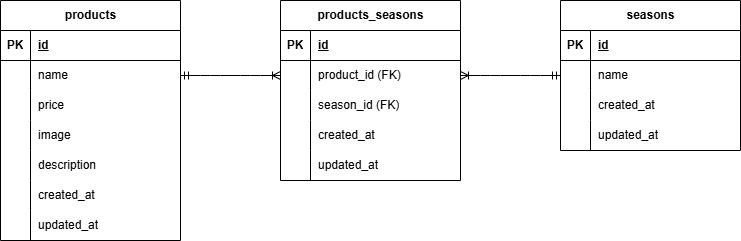

# 確認テスト　もぎたて

## 環境構築

リポジトリの設定

    ・　git clone リンク（SSH）

Docker の設定

    ・　docker-compose up -d --build

    ・　code .

    ・　docker-compose.yml の修正
            (1行目のversionをコメントアウト⇒修正後はコンテナ再構築)

Laravel のパッケージのインストール

    ・　docker-compose exec php bash

    ・　composer install
            （composer -vでインストールの確認）

.env ファイルの作成

    ・　cp .env.example .env

    ・　.envファイルに下記の環境変数を追加
            （Laravelのプロジェクトとデータベースを接続⇒修正後はキャッシュクリア）

        DB_CONNECTION=mysql
        DB_HOST=mysql
        DB_PORT=3306
        DB_DATABASE=laravel_db
        DB_USERNAME=laravel_user
        DB_PASSWORD=laravel_pass

アプリケーションキーの作成

    ・　php artisan key:generate

モデルの作成

    ・　php artisan make:model
            (中間テーブルが存在する場合、マイグレーションテーブルとモデルは別作成推奨)

マイグレーションの実行

    ・　php artisan make:migration

    ・　php artisan migrate

ダミーデータの作成

    ・　php artisan make:seeder

    ・　php artisan db:seed

view ファイルの作成

    ・　viewファイルの作成

    ・　php artisan make:controller

    ・　web.phpの修正

シンボリックリンクの作成

    ・　php artisan storage:link

## 使用技術

バージョン情報

    ・　php:8.1-fpm

    ・　Laravel 8.83.29

    ・　MySQL 8.0.26

開発言語

    ・　HTML5・CSS

    ・　Laravel PHP

    ・　Command Line

    ・　MySQL

    ・　JavaScript（画像表示）

## ER 図

        ## ER図

## URL

開発環境 http://localhost/

phpMyAdmin http://localhost:8080/
